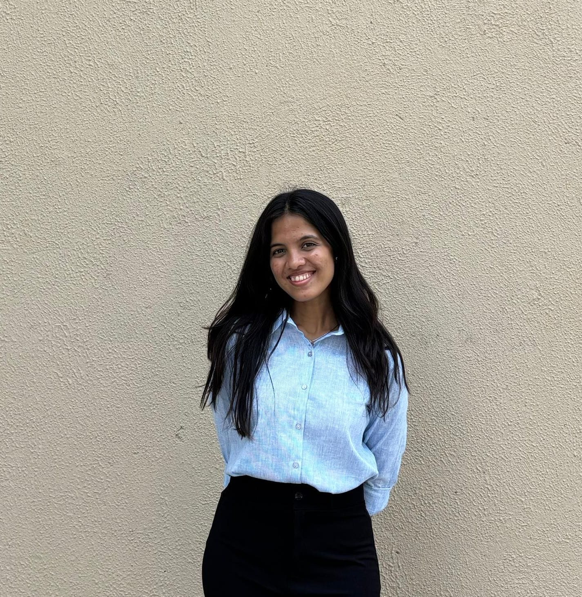

```{=html}
<div class="profile-container">
  <div class="profile-image">
    
    <div class="profile-links">
      <a href="https://github.com/deena-lad" target="_blank">
        
          <span class="link-text">GitHub</span>
      </a>
      <a href="https://www.linkedin.com/in/deena-lad-307645214/" target="_blank">
        
          <span class="link-text">LinkedIn</span>
      </a>
      <a href="mailto:deenalad06@gmail.com" target="_blank">
        
          <span class="link-text">Email</span>
      </a>
    </div>
  </div>
  <div class="profile-text">
    <p>
      I am a Data Science graduate with experience across applied machine learning, deep learning, and research-driven problem solving. My work spans environmental modelling using geospatial data, medical imaging with deep neural networks, and large language model applications in industry settings.
    </p>

    <p>
      I am particularly interested in building reliable ML systems for real-world, high-impact domains such as climate, geospatial analytics, and healthcare, where model performance and interpretability matter as much as accuracy.
    </p>

    <p>
      Beyond data, I am a trained Bharatanatyam dancer and enjoy immersing myself in the mysterious worlds of Agatha Christie.
    </p>
  </div>
</div>
```